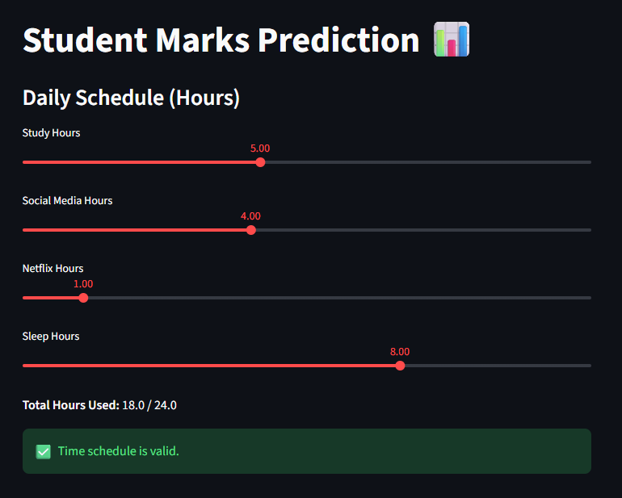

# 📚 Student Performance Prediction System

A machine learning web application that predicts a student's exam score based on their daily habits and lifestyle factors. Built using a **Linear Regression** model trained on the **Student Habits & Performance Dataset**, and deployed live via **Streamlit**.

[](https://2dzmawd8ehcgq4djpetygx.streamlit.app/)

---

## 🚀 Live Demo

🔗 [Click here to try the app](https://2dzmawd8ehcgq4djpetygx.streamlit.app/)

---

## 🖼️ App Screenshot



---

## 📌 Project Overview

This project explores how student lifestyle habits — such as study hours, sleep, social media usage, and mental health — impact academic performance. Given a set of behavioral inputs, the model predicts the expected exam score (out of 100). Unlike typical performance prediction models that rely on past grades, this system focuses entirely on **habit-based features**, making it practically useful for early academic intervention.

---

## 📊 Dataset

- **Source:** Student Habits & Performance Dataset (Kaggle)
- **Records:** 1,000 student entries
- **Features:** 14 input features + 1 target variable
- **Target:** `exam_score` — continuous score between 0 and 100

| Feature | Description |
|---|---|
| study_hours_per_day | Daily hours spent studying |
| social_media_hours | Daily hours on social media |
| netflix_hours | Daily hours spent on Netflix |
| attendance_percentage | Class attendance percentage |
| sleep_hours | Average sleep hours per night |
| exercise_frequency | Number of exercise sessions per week |
| mental_health_rating | Self-rated mental health (1–10) |
| part_time_job | Whether the student has a part-time job (Yes/No) |
| extracurricular_participation | Participation in extracurriculars (Yes/No) |
| diet_quality | Diet quality (Poor / Fair / Good) |
| parental_education_level | Highest parental education level |
| internet_quality | Internet quality at home (Poor / Average / Good) |
| gender | Gender of the student |
| age | Age of the student |

---

## 🧠 Model Details

**Model:** `LinearRegression` (scikit-learn)

- Categorical features label-encoded before training
- Features scaled using `StandardScaler`
- Model, scaler, and feature names saved separately using `joblib`

**Performance Metrics (Test Set):**

| Metric | Value |
|---|---|
| R² Score | 0.889 |
| MAE | 4.24 marks |
| RMSE | 5.50 marks |

**Interpretation:** The model explains ~89% of variance in exam scores using only habit-based inputs. On average, predictions are off by ~4 marks — strong performance for behavioral data.

**Top Influential Features (by model coefficient):**

| Feature | Impact |
|---|---|
| study_hours_per_day | +79.84 (strongest positive driver) |
| mental_health_rating | +17.85 |
| sleep_hours | +13.20 |
| exercise_frequency | +9.16 |
| social_media_hours | -19.11 (strongest negative driver) |
| netflix_hours | -11.59 |

---

## 🛠️ Tech Stack

| Layer | Technology |
|---|---|
| Language | Python 3.x |
| ML Libraries | scikit-learn, NumPy, pandas |
| Model Serialization | joblib |
| Web App | Streamlit |
| Deployment | Streamlit Cloud |

---

## 📁 Project Structure

```
student-performance-prediction-system/
│
├── app.py                                       # Streamlit web application
├── model.pkl                                    # Trained Linear Regression model
├── scaler.pkl                                   # Fitted StandardScaler
├── feature_names.pkl                            # Feature column names
├── student_habits_performance.csv               # Dataset
├── Student_Performance_Prediction_System.ipynb  # EDA, training, and evaluation notebook
├── requirements.txt                             # Python dependencies
└── README.md                                    # Project documentation
```

---

## ⚙️ Run Locally

1. **Clone the repository**
   ```bash
   git clone https://github.com/<your-username>/student-performance-prediction-system.git
   cd student-performance-prediction-system
   ```

2. **Install dependencies**
   ```bash
   pip install -r requirements.txt
   ```

3. **Run the Streamlit app**
   ```bash
   streamlit run app.py
   ```

4. Open your browser at `http://localhost:8501`

---

## 📈 Workflow

```
Raw Data (CSV)
     │
     ▼
Exploratory Data Analysis (EDA)
     │
     ▼
Label Encoding (Categorical Features)
     │
     ▼
Feature Scaling (StandardScaler)
     │
     ▼
Model Training (Linear Regression)
     │
     ▼
Model Evaluation (R² = 0.889, MAE = 4.24)
     │
     ▼
Model Serialization (joblib → .pkl)
     │
     ▼
Streamlit Web App → Deployed on Streamlit Cloud
```

---

## ⚠️ Disclaimer

This application is built for **educational and demonstration purposes only**. Predictions are based on behavioral patterns in a synthetic dataset and should not be used for academic assessment or decision-making.

---

## 👤 Author

**Navneet**
- 📧 [navneetnitin.ece87@gmail.com]
- 💼 [https://www.linkedin.com/in/navneet-nitin]
- 🐙 [https://github.com/navneet-nitin]

---

## 📄 License

This project is licensed under the [MIT License](LICENSE).
